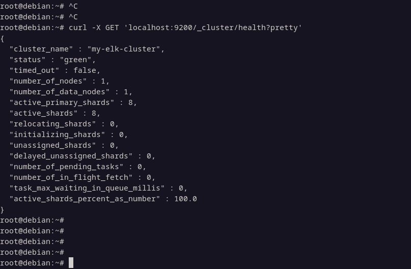
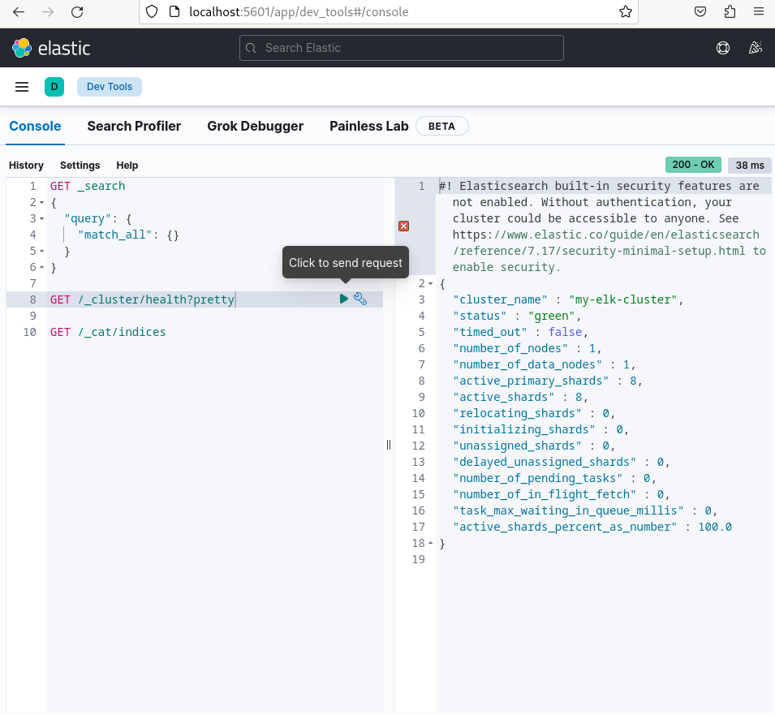
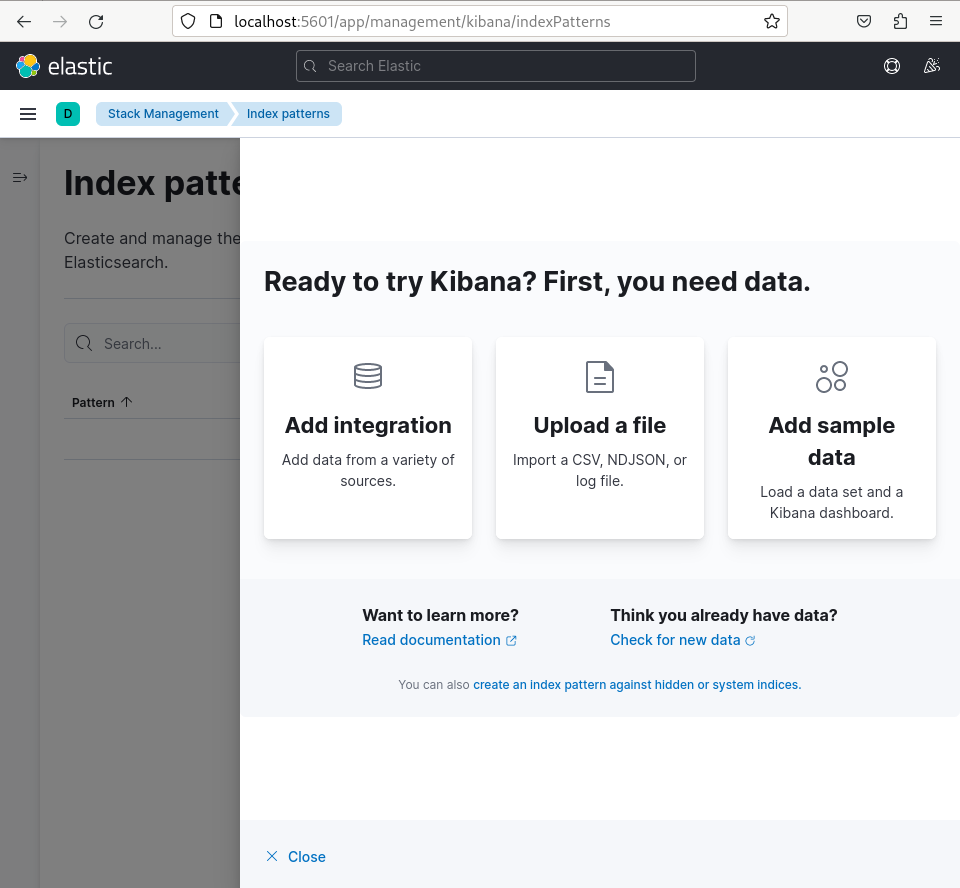
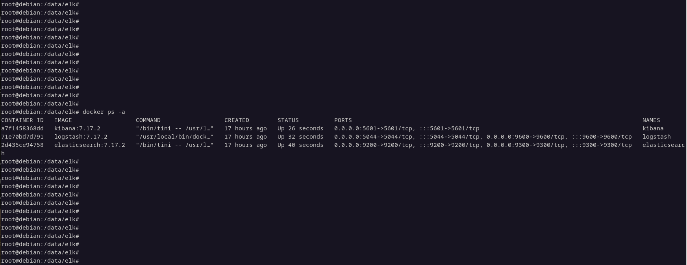
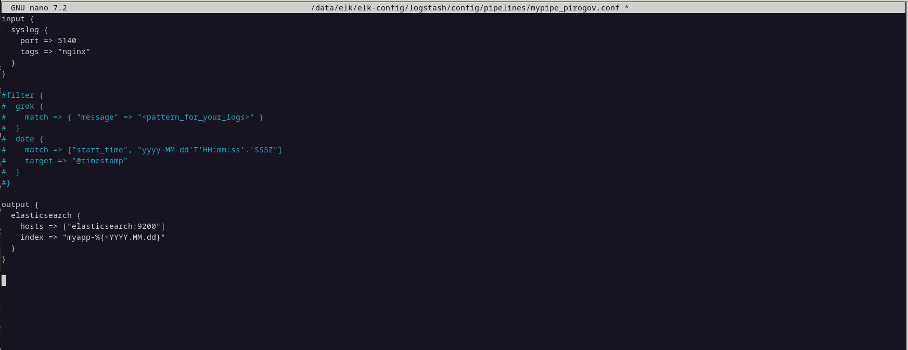
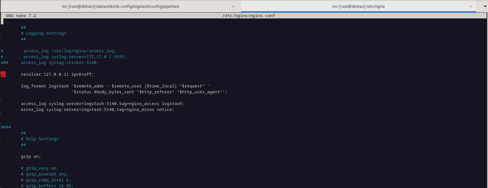

7# «ELK» - Pirogov Anton

###     Задание 1 

###     Задание 2

###     Задание 3

1. Как логи собрать в с nginx в logstash, не совсем понимаю. Как направить логи с nginx который стоит на хосте, в logstash который поднят в docker. 
   В nginx.conf сделана такая запись - access_log syslog:server=logstash:5140, Как он будет направлять туда логи если nginx не знает что такое logstash
   Возможно оно будет работать если прописать там ip контейнера, но это бред и почему высвечивается данное сообщение:

[compose.yml](./files/compose.yml)
