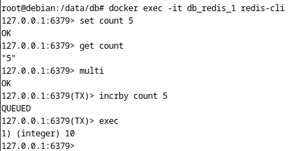

# «Кеширование Redis/memcached» - Pirogov Anton

###     Задание 1 

1. Уменьшение задержек при передаче контента
2. Увеличение производительности ПО 
3. Масштабирование 
4. Позволяет избежать избыточного выделения ресурсов БД
5. Обеспечение надежности при изменении формата хранилища

###     Задание 2

###     Задание 3

###     Задание 4

###     Задание 5

